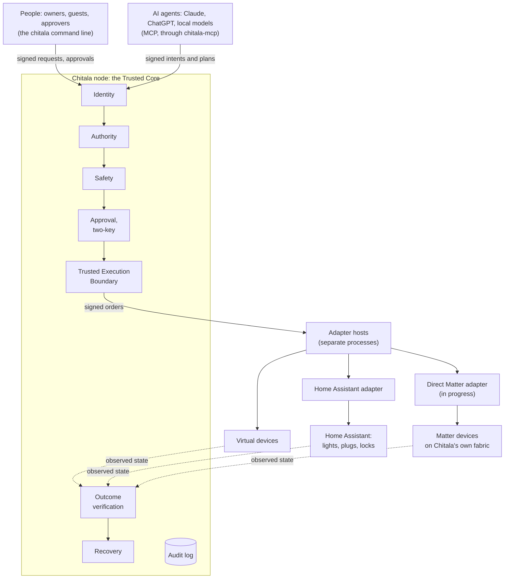

<p align="center">
  
</p>

<h1 align="center">Chitala OS</h1>

<p align="center"><strong>An operating system for a world where people, AIs, robots, devices and distributed compute all act on the physical world — security and safety by design.</strong></p>

Chitala treats humans, AIs/agents, robots, devices, services and compute as principals with identity, capability, authority, state and provenance. During the bootstrap phase (**Hosted Mode**) it runs on Linux, macOS, Windows or an RTOS. The architecture itself depends on no host OS, ISA, AI runtime, protocol or cloud, and the long-term goal is **Chitala Native**, booting directly on hardware.

The current blueprint is **v20** (*Chitala OS Blueprint 2026–2046*, maintained outside this repository). How it maps to the code is in [`docs/v20-alignment.md`](docs/v20-alignment.md).

This repository is the **v0.2 reference implementation** in Rust (a pre-release), running in Hosted Mode. It starts with a small, verifiable *Trusted Core* — not an AI, not a UI, not a kernel yet.

```
Principal → Identity → Capability → Intent → Authority → Reference Monitor → Execution → State → Audit
```

> **Invariant 1 — AI produces Intent. Chitala produces Authority. Only the trusted execution boundary produces physical Commands.**

An AI never sends a command. It sends a signed *intent*: *actor → on_behalf_of → action → resource → context → constraints → requested_at*.

- The Authority Engine answers WHO → ON_BEHALF_OF → WHAT → OBJECT → CONTEXT → DELEGATION → RISK → APPROVAL → ALLOW/DENY/ESCALATE.
- An independent safety layer can only refuse.
- Only the node's trusted execution boundary produces a physical command.

That is what makes Chitala different from an MCP gateway. Specs: [14 Resource](specs/14-resource-model.md) · [15 Intent](specs/15-intent.md) · [16 Authority Engine](specs/16-authority-engine.md) · [17 Safety](specs/17-safety.md).

## Architecture overview

What runs today:



- **Implemented today:** Identity → Intent → Authority → Safety → Approval → Trusted Execution Boundary → Adapters → Outcome verification → Recovery. Also plans, execution leases, the audit log and the MCP broker. Devices are virtual, or reached through a real Home Assistant.
- **In progress:** the direct Matter adapter, and validation on physical devices (v0.3 steps ⑤, ③B and ④).
- **Future:** robot and vehicle profiles, a richer device runtime, broader telemetry and reporting, an app or dashboard.

### Target architecture

> The diagram below shows Chitala's **target** architecture, not only what is implemented. Parts marked *future* or *in progress* are not done yet. [`docs/architecture/target-architecture.md`](docs/architecture/target-architecture.md) gives the status of every part, and the [roadmap](ROADMAP.md) the plan.


## Status

| Milestone | | |
|---|---|---|
| 0.0.1 | A virtual light on/off with authorization + state + audit; an unauthorized AI → DENY → security event → audit | ✅ |
| 0.0.2 | Several users and devices; delegation and revocation | ✅ |
| 0.0.3 | HTTP/MQTT/WoT adapters + a virtual home | 🟡 virtual home, Home Assistant (WebSocket + REST) |
| **Physical Authority Slice v0.1** | MCP → Intent → Authority → Safety → Approval → Capability → simulated door | ✅ |
| **v0.2** | Platform independence and the Trusted Execution Boundary: execution leases, outcome verification and recovery, plans ([ROADMAP](ROADMAP.md), [audit](docs/audit/v0.2-rc-audit.md)) | ✅ `v0.2.0` pre-release |
| v0.3 | Home Reference Implementation: real AIs, real devices (Home Assistant, Matter) | 🟡 Home profile; Home Assistant adapter checked with a real AI, a real Home Assistant and Matter SDK devices; adapter conformance suite; direct Matter adapter in progress; physical devices pending |

| # | Physical Authority Slice v0.1 case | Required | |
|---|---|---|---|
| 1 | Owner's AI → turn on the light | ALLOW | ✅ |
| 2 | Guest's AI → turn on a delegated light | ALLOW | ✅ |
| 3 | Child's AI → open the door without permission | DENY | ✅ |
| 4 | Owner's AI → open the door (high risk) | ESCALATE → human approval | ✅ |
| 5 | AI A → asks AI B to open the door to dodge policy | DENY | ✅ |

Every change runs the full test suite in CI on Linux x86_64, Linux ARM64 and macOS, plus coverage-guided fuzzing of every trust boundary, and boots the Native unikernel in QEMU (see the *Actions* tab for the current count). The suite has unit, integration, property-based and attack tests: an impostor node, state rollback, audit deletion, replay, prompt injection, delegation amplification, authority laundering through another AI, forged approvals, approval fatigue, time-of-check/time-of-use races, a clock set back… See [`specs/13-threat-model.md`](specs/13-threat-model.md).

## Try it

Requires Rust ≥ 1.89 (the MSRV is checked in CI).

```bash
cargo test --workspace           # all tests
cargo run -p chitala-cli -- demo # the Physical Authority Slice v0.1 in memory, explained step by step
```

Run a real Home Node with four virtual devices:

```bash
cargo build --workspace
B=target/debug
$B/chitala init ./home
export CHITALA_CONFIG=./home/chitala.json
$B/chitala node &                                   # the Home Node on a Unix socket

$B/chitala invoke --as person:alice device:living-room-light light.turn_on   # a person: direct request
$B/chitala invoke --as ai:assistant device:living-room-light light.turn_off  # DENY E_INTENT_REQUIRED
$B/chitala intent --as ai:assistant resource:living-room-light light.turn_off # DENY E_TOKEN_MISSING
$B/chitala delegate --as person:alice --to ai:assistant resource:front-door lock.unlock  # token → home/tokens/
$B/chitala intent --as ai:assistant resource:front-door lock.unlock --purpose "the plumber is here"
                                                    # ESCALATE (exit 4): waiting for alice
$B/chitala approvals --as person:alice              # see exactly what is asked, with its digest
$B/chitala approve --as person:alice <intent-id>    # ALLOW → the door unlocks
$B/chitala audit verify
```

Let an AI (an MCP client such as Claude Desktop) use the devices within its delegated scope:

```bash
$B/chitala-mcp --config ./home/chitala.json --as ai:assistant
```

> `chitala init` puts every key of the sample domain into one `keys/` directory (mode 0700) so you can try it on one machine. In a real deployment each person's key stays on their own device, and the authority key belongs in a TPM or secure element.

## Layout

| Crate | Role | Spec |
|---|---|---|
| `chitala-model` | Identifiers, classification scales, capability registry, payloads | 01, 03, 04 |
| `chitala-identity` | One Ed25519 key per principal, the registry, agency (`serves`) | 02, 15 |
| `chitala-resource` | Resource Model: the governed physical world (ownership, parent/child tree, location, state reference, bindings) | 14 |
| `chitala-intent` | Intents and approvals: signed wire formats, relay chains, execution lease clauses, unforgeable `Verified*` types | 15, 21 |
| `chitala-token` | Capability tokens (Biscuit): holder-bound, offline attenuation, non-amplifying delegation, revocation | 05 |
| `chitala-policy` | Cedar policy + Security Constitution, schema generated from the registry; the **Authority Engine** | 00, 06, 16 |
| `chitala-safety` | An independent safety layer that can only refuse (SAFE-1…8) | 17 |
| `chitala-csme` | Chitala Secure Message Envelope: COSE_Sign1 + canonical CBOR | 07 |
| `chitala-monitor` | Reference Monitor — the single, non-bypassable decision point | 08 |
| `chitala-audit` | Hash-chained audit log, signed checkpoints, redaction, anti-rollback anchor | 09 |
| `chitala-state`, `chitala-bus` | Digital Twin (reported/desired/drift), an event bus that favours security events | 10 |
| `chitala-boundary` | The Trusted Execution Boundary: the only producer of physical commands; order receipts | 19 |
| `chitala-adapters` | Process-isolated adapter host (accepts only orders from the boundary, answers with receipts), virtual devices, Home Assistant bridge | 10, 19 |
| `chitala-node` | Home Node (details below); binary `chitala-adapter-host` | 11, 15–17 |
| `chitala-mcp` | AI Action Broker over the Model Context Protocol — emits intents only | 12 |
| `chitala-platform` | Platform Abstraction Layer: clock, entropy, key store, storage, IPC, network, execution, device I/O; memory backend and contract tests | 18 |
| `chitala-platform-host` | The hosted backend (Linux, macOS) | 18 |
| `chitala-cli` | The `chitala` command | — |
| `native/` | Native spike: the node core as a Hermit unikernel on QEMU/Arm, with no host OS (`native/run.sh`) | 20 |

`chitala-node` provides:

- IPC signed in both directions;
- the intent path and the approval queue;
- execution leases: granted once, every use judged again and counted before its order (spec 21);
- the wiring to the **Trusted Execution Boundary** (`chitala-boundary`), receipt checks and state refresh;
- outcome verification against each resource's witness, and recovery when an action does not take effect: only its safe state runs, which the node tries once by itself, until a person releases it (spec 22);
- plans: several intents in order, each judged when it runs and started only after the one before has verifiably taken effect; a step that needs a person pauses the plan (spec 23);
- domain operations and containment;
- integrity checks at start-up.

The specifications live in [`specs/`](specs/README.md). The default policy is [`specs/policy/default.cedar`](specs/policy/default.cedar), and the registry is [`specs/registry/capabilities-v0.1.json`](specs/registry/capabilities-v0.1.json).

## Security principles

- **AI produces Intent. Chitala produces Authority. Only the trusted execution boundary produces physical Commands.**
- An AI is an **untrusted-by-default** principal (Security Constitution C11/C12):
  - it has no ambient authority;
  - it acts only for the people it is declared to serve, through tokens a human delegated;
  - a high-risk action always needs an owner's approval;
  - it never modifies the protections.
- Asking another AI adds no authority: the authority of a relay chain is the intersection of every link.
- Safety is independent of policy and can only refuse. Not even a human's approval overrides safety.
- Every request is signed and goes through the Reference Monitor; every node reply is signed and bound to its request.
- Delegation only narrows authority (property-tested), and revocation cascades to every child token.
- No evidence, no action: the decision is written to the audit log before anything executes.
- Fail closed: a policy error, a broken audit log, a rolled-back state or a node panic all lead to refusal.
- The Trusted Core reaches the machine only through the Platform Abstraction Layer; CI checks it (`scripts/core-purity.py`), so Chitala can move to other platforms and to Chitala Native without rewriting the core.
- All code is `#![forbid(unsafe_code)]`.

## Contributing and governance

> **Code is open. Implementation is forkable. Specification is implementable.**
> The CHITALA identity, the official specification, conformance marks, certification and official releases remain governed.

- [`CONTRIBUTING.md`](CONTRIBUTING.md) — fork → signed-off commits ([DCO](DCO.md)) → pull request → CI → review → merge.
- [`GOVERNANCE.md`](GOVERNANCE.md) — who decides what: Trusted Core, Security Constitution, specification, registry, releases.
- [`SPECIFICATION_POLICY.md`](SPECIFICATION_POLICY.md) — anyone may implement the specification; only the official text is the *Chitala Specification*.
- [`CERTIFICATION.md`](CERTIFICATION.md) — based on Chitala → Chitala Compatible → Chitala Certified (not open yet).
- [`COMPATIBILITY.md`](COMPATIBILITY.md) — versions, wire formats, supported platforms.
- [`TRADEMARK.md`](TRADEMARK.md) — forks are welcome under their own name; the Chitala name and logo stay with the official project.

## Roadmap and license

The Trusted Core is complete for now (v0.2) and in a **core freeze**. The current milestone, v0.3, connects real AIs and real devices through Home Assistant and Matter adapters, outside the Trusted Core. Priorities are in [`ROADMAP.md`](ROADMAP.md).

To report a security issue, see [`SECURITY.md`](SECURITY.md) — please do not open a public issue.

The code and the specification are licensed under [Apache-2.0](LICENSE). The Chitala name and logo are not (see [`TRADEMARK.md`](TRADEMARK.md) and [`NOTICE`](NOTICE)).
