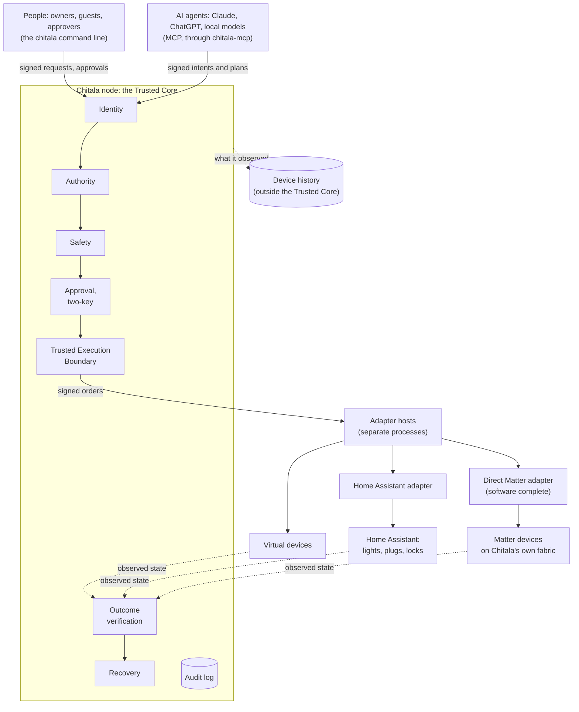
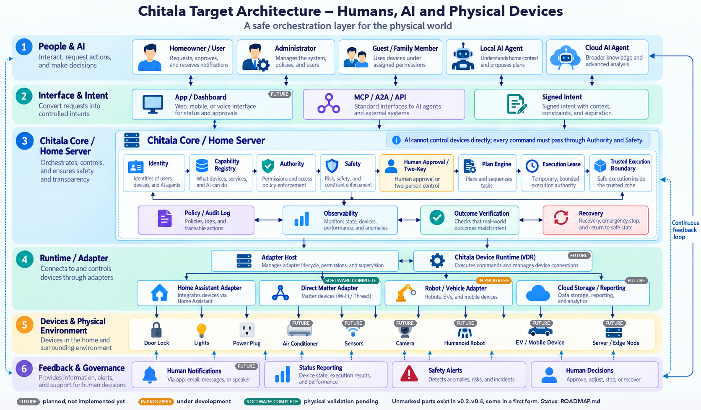

<p align="center">
  
</p>

<h1 align="center">Chitala OS</h1>

<p align="center"><strong>An operating system for a world where people, AIs, robots, devices and distributed compute all act on the physical world — security and safety by design.</strong></p>

Chitala treats humans, AIs/agents, robots, devices, services and compute as principals with identity, capability, authority, state and provenance. During the bootstrap phase (**Hosted Mode**) it runs on Linux, macOS, Windows or an RTOS. The architecture itself depends on no host OS, ISA, AI runtime, protocol or cloud, and the long-term goal is **Chitala Native**, booting directly on hardware.

The current blueprint is **v20** (*Chitala OS Blueprint 2026–2046*, maintained outside this repository). How it maps to the code is in [`docs/v20-alignment.md`](docs/v20-alignment.md).

This repository is the **v0.2 reference implementation** in Rust (a pre-release), running in Hosted Mode. It starts with a small, verifiable *Trusted Core* — not an AI, not a UI, not a kernel yet.

```
Principal → Identity → Capability → Intent → Authority → Reference Monitor → Execution → State → Audit
```

> **Invariant 1 — AI produces Intent. Chitala produces Authority. Only the trusted execution boundary produces physical Commands.**

An AI never sends a command. It sends a signed *intent*: *actor → on_behalf_of → action → resource → context → constraints → requested_at*.

- The Authority Engine answers WHO → ON_BEHALF_OF → WHAT → OBJECT → CONTEXT → DELEGATION → RISK → APPROVAL → ALLOW/DENY/ESCALATE.
- An independent safety layer can only refuse.
- Only the node's trusted execution boundary produces a physical command.

That is what makes Chitala different from an MCP gateway. Specs: [14 Resource](specs/14-resource-model.md) · [15 Intent](specs/15-intent.md) · [16 Authority Engine](specs/16-authority-engine.md) · [17 Safety](specs/17-safety.md).

## Architecture overview

What runs today:



- **Implemented today:** Identity → Intent → Authority → Safety → Approval → Trusted Execution Boundary → Adapters → Outcome verification → Recovery. Also plans, execution leases, the audit log and the MCP broker, and a local history of device state that people and AIs read through the node, under Authority. Devices are virtual, reached through a real Home Assistant, or reached directly over Matter on Chitala's own fabric.
- **Software complete, physical validation pending:** the direct Matter adapter and the adversarial Home suite (v0.3 steps ⑤ and ⑥). Validation on physical devices is v0.3 steps ③B and ④.
- **In progress:**
  - **Robots (v0.4).** The Robot Profile v0.1 for a differential-drive ground robot is done:
    - its Safety rule, `SAFE-9-MOTION`, with a stop that always wins;
    - outcomes as a pose within a tolerance;
    - a simulator, and an adversarial suite (finding F13 fixed).

    Physical robots come later.
  - **Native.** N1, the partitioning spike on seL4, is done ([`native/spike/`](native/spike/README.md)). [ADR 0002](docs/adr/0002-production-native-architecture.md) chooses seL4 + Microkit conditionally, with Bao as the fallback. Next, the Native Hardware Gate H0 takes it to real hardware.
- **Done in v0.4:** history-derived Safety (`SAFE-10-HISTORY`, its evaluator in its own process, the history chain anchored in the audit log), and the safety case.
- **Future:** vehicle profiles, a richer device runtime, broader telemetry and reporting, an app or dashboard.

### Target architecture

> The diagram below shows Chitala's **target** architecture, not only what is implemented. Parts marked *future* or *in progress* are not done yet. [`docs/architecture/target-architecture.md`](docs/architecture/target-architecture.md) gives the status of every part, and the [roadmap](ROADMAP.md) the plan.



## The Authority and Safety layer

Chitala's job is one question, asked before every physical action and checked after it:

> **Who may make this physical system do what, by what right, on what evidence, under what safety conditions — and did it actually happen?**

It answers with a chain. Each link can only narrow what the one before allowed, and all of it is on record before anything moves:

```text
signed request or intent
  → Identity      who is asking, for whom (people, AIs, services, devices)
  → Authority     may they?            ALLOW / DENY / ESCALATE to a person
  → Safety        is it safe now?      PASS / DENY — never ALLOW
  → Approval      the owner(s) agree to this exact request (two keys where required)
  → Boundary      one signed, single-use order — the only thing that reaches a device
  → Adapter       a separate process; executes the order once, never resends
  → Outcome       the world is observed: did the promised effect happen?
  → Recovery      if not: the resource is held, brought to its safe state on evidence, until a person ends it
  ↘ Audit         hash-chained, signed, anti-rollback; written before anything executes
```

### Authority: who may do what

- **Principals with identities.** People, AIs, services and devices each have an Ed25519 key. An AI acts only *on behalf of* the people it is declared to serve ([02](specs/02-identity.md), [15](specs/15-intent.md)).
- **Capability tokens** (Biscuit) are bound to their holder's key and can only be narrowed when delegated. They expire, and a revocation reaches every token below the revoked one, or everything issued before a revocation floor ([05](specs/05-capability-token.md)).
- **The Authority Engine** decides WHO → ON_BEHALF_OF → WHAT → OBJECT → CONTEXT → DELEGATION → RISK → APPROVAL, under a Cedar policy and the Security Constitution ([16](specs/16-authority-engine.md), [00](specs/00-security-constitution.md)).
  - A binding can raise an action's risk.
  - A relay through another AI adds no authority: a chain is the intersection of its links.
- **People decide what is risky.**
  - A high-risk action asks an owner. The approval is bound to the exact request's digest, and expires.
  - A two-key resource needs two different people.
  - An execution lease grants a bounded number of uses within a window; each use is judged again.
  - Plans run step by step, each step judged when it runs ([21](specs/21-execution-lease.md), [23](specs/23-plan-engine.md)).
- **Authority is checked again at the moment of use, not only when asked.** These all stop an order still in flight:
  - a revocation;
  - a demoted approver;
  - an expired token;
  - a safety hold placed while a person decides.

  The authority epoch makes a rolled-back state file refuse to start.
- **An AI never administers the domain.** It cannot place or lift safety holds, end a recovery, or set history rules (C11).

### Safety: what must never physically happen, whoever asks

Safety is independent of policy and **can only refuse**. Not even an owner's approval overrides it. It runs before a person is asked, and again right before the boundary mints an order ([17](specs/17-safety.md)):

| Rule | Refuses |
|---|---|
| `SAFE-1-HOLD` | anything on a resource under a person's safety hold, or below it |
| `SAFE-2-DEVICE` | anything through a contained device; high-risk actions through a device that is not trusted |
| `SAFE-3-STATE` | actions of medium risk or more on state that is unknown or too old: a device nobody can observe is not "still locked" |
| `SAFE-4-PHYSICAL` | actions that contradict the physical state, such as locking a door that stands open |
| `SAFE-5-ENVELOPE` | parameters outside the resource's own limits, tighter than the registry's |
| `SAFE-6-RATE` | more actuations than the resource tolerates, from oscillation or looping agents |
| `SAFE-7-BUSY` | a second action on a device or resource still being acted on, even through another device |
| `SAFE-8-RECOVERY` | anything but the safe state on a resource whose last action missed its outcome, until a person ends the recovery |
| `SAFE-9-MOTION` | a robot's motion with its emergency stop pressed, an obstacle detected, while moving, from a stale or future-dated pose, or out of its geofence |
| `SAFE-10-HISTORY` | an action a history rule governs, without a valid, fresh, signed verdict that the limit is kept ("the pump has run at most 30 minutes") |

**A stop always wins.** No rule, hold, recovery, rate limit or history rule keeps back an action that only halts a machine. A right to move a robot includes the right to stop it.

### Execution, outcome and recovery

- **One path to an actuator.** Only the trusted execution boundary produces commands. An order is signed, bound to one executor session, single-use and short-lived ([19](specs/19-execution-boundary.md)).
  - Adapters run in separate processes and accept nothing else.
  - CI checks that no second path exists (`scripts/check-execution-boundary.py`).
- **A command is not a result.** Every action declares a checkable outcome: a state, or a pose within a tolerance. Only state *confirmed current after the order* counts as evidence ([22](specs/22-outcome-recovery.md)).
  - An answer lost on the way is never resent: its fate is settled from what the device shows.
  - When nobody can establish the fate of an action of medium risk or more, the resource goes into recovery.
- **Recovery never acts blind.** The safe state is sent again only on *new* evidence that the resource is still unsafe: one order per confirmed observation, as often as that capability's retry policy allows. A stop may follow one that did not take; a lock goes to a person.
- **History** stays outside the Trusted Core ([29](specs/29-telemetry-history.md), [32](specs/32-checked-history-constraints.md)).
  - A separate evaluator process measures the worst case, so unknown time counts against the limit.
  - It signs a short-lived verdict bound to the exact request.
  - Its hash-chained log is anchored in the audit log, so a log cut back is provable.

### The evidence behind it

- **A safety case** ([`docs/safety/`](docs/safety/README.md)):
  - 31 hazards, each traced to the rules that control it, the tests that prove them and the mutation runs that check those tests;
  - CI fails when a hazard, rule, test or mutation set goes missing;
  - a change to a safety-critical file must state its safety impact and needs an independent reviewer.
- **Mutation testing in the repository** ([`mutation/`](mutation/README.md)): 22 sets, 221 faults put back on purpose, each of which a test must catch. CI runs them weekly. The first run of the Safety set found three gaps in its unit tests, now closed.
- **Attack and adversarial suites:** the threat model's attacks, each with a test ([13](specs/13-threat-model.md)); the Home adversarial suite; the robot adversarial suite; a seeded crash-and-restart regression suite.
- **Coverage-guided fuzzing** of every trust boundary, and ThreadSanitizer runs of the concurrent suites.
- **Lab validation:** a real AI and a real Home Assistant in 21 scenarios, and Matter SDK devices in 17 checks.

### How strong is it?

The Project Lead's assessment of 2026-10-07, after the safety case's evidence gaps were closed. It is an internal assessment, not an independent audit or a certification:

| Area | Assessment |
|---|---|
| Identity, agency, delegation, revocation | **9/10** |
| Human approval, two keys, leases | **9/10** |
| Time-of-check/time-of-use, authority fencing of orders in flight | **9/10** |
| Safety semantics, `SAFE-1` to `SAFE-10` | **9/10** |
| Outcome verification and recovery | **9/10** |
| Audit, anti-rollback, history safety | **8.5–9/10** |
| Adversarial and mutation evidence | **9/10** |
| Safety engineering process | **8.5/10** |
| Typed physical evidence | **6/10**: robots report flags (obstacle, emergency stop), not typed, current evidence with its source, time, scope and quality |
| Hardware and platform containment | **5/10**: on a hosted OS, Chitala trusts the kernel and the account; the Native spike still shares one address space between core, adapters and keys |
| Production assurance overall | **not yet at the level of safety-critical production** |

The weakest parts are no longer in the Authority Engine or the Safety rules. They are below them:
- can a compromised adapter read the core's memory or keys?
- can an adapter that spins the CPU delay a stop?
- can a device's DMA write into the core?

**Native N1** answers these on seL4, with seven criteria that can each fail ([plan](docs/native/n1-partitioning-spike.md), [`native/spike/`](native/spike/README.md)). The Authority and Safety layer is a near-frozen baseline meanwhile. Its core changes only for a real defect, for an abstraction N1 shows is not enough, or for a general primitive a new domain cannot do without.

After N1, the layer grows in four directions, not in more rules ([roadmap](ROADMAP.md)):
- **typed safety evidence:** a source, a time, an expiry, a scope, provenance and quality, judged by Safety;
- **assurance levels A0 to A3:** from a light bulb to a vehicle, each level states requirements a machine can check;
- **temporal guarantees:** decision and stop deadlines per profile;
- **independent, diverse evidence** for high-consequence systems.

What stays outside Chitala, by design:
- perception, SLAM and planning;
- vision-language-action models;
- Home Assistant, ROS and AUTOSAR themselves.

Chitala governs them through adapters, and takes their output as evidence. A robot's own hardware emergency stop and watchdogs stay beneath Chitala, never replaced by it.

**New kinds of devices come as profiles and adapters, not as changes to the core.** A capability is typed and bounded, and declares its risk, its outcome and its safe state. An unknown capability is refused, never assumed safe. Where the code still falls short of this, and what comes next for the Home profile (climate, media, camera, pump), is in the [roadmap](ROADMAP.md).

## Status

| Milestone | | |
|---|---|---|
| 0.0.1 | A virtual light on/off with authorization + state + audit; an unauthorized AI → DENY → security event → audit | ✅ |
| 0.0.2 | Several users and devices; delegation and revocation | ✅ |
| 0.0.3 | HTTP/MQTT/WoT adapters + a virtual home | 🟡 virtual home, Home Assistant (WebSocket + REST) |
| **Physical Authority Slice v0.1** | MCP → Intent → Authority → Safety → Approval → Capability → simulated door | ✅ |
| **v0.2** | Platform independence and the Trusted Execution Boundary: execution leases, outcome verification and recovery, plans ([ROADMAP](ROADMAP.md), [audit](docs/audit/v0.2-rc-audit.md)) | ✅ `v0.2.0` pre-release |
| v0.3 | Home Reference Implementation: real AIs, real devices (Home Assistant, Matter) | 🟡 Home profile; Home Assistant adapter checked with a real AI, a real Home Assistant and Matter SDK devices; adapter conformance suite; direct Matter adapter and adversarial suite software complete; physical devices pending |
| v0.4 | Device history, robots, history-derived Safety | ✅ in software: local history, read through the node as `device.read_history`; Robot Profile v0.1 with `SAFE-9-MOTION` and a simulator ([spec 30](specs/30-robot-profile.md)); the robot adversarial suite ([spec 31](specs/31-robot-adversarial-suite.md)); `SAFE-10-HISTORY` with its evaluator and the anchored history chain ([spec 32](specs/32-checked-history-constraints.md)); the safety case ([`docs/safety/`](docs/safety/README.md)). Physical robots pending |
| Native N1 | The partitioning spike: the core and its adapters in separate domains on seL4 | ✅ **Done: [ADR 0002](docs/adr/0002-production-native-architecture.md) accepted (2026-10-08)**, conditionally (below). [Plan](docs/native/n1-partitioning-spike.md); N1.0 to N1.2 ✅ (the toolchain pinned and verified; protection domains and a channel; libvmm's Linux guest); **N1.3 ✅, the go/no-go: GO**: the Chitala Native image runs unchanged as a guest on seL4, 13/13 decisions as expected. seL4 stays the primary candidate, not yet chosen. **N1.4 ✅**: the adapter host in a second guest, behind a relay that copies bytes; the node's crates unchanged; an adapter guest that disappears leaves the order's fate unknown (14/14). **N1.5a ✅**: the adapter's guest shares no device with the core's. **N1.5b ✅**: a guest given a device tree claiming more RAM than seL4 granted it faults at seL4's stage-2, on its own VMM, while the core's state stays intact (its audit chain still verifies); the VMM-capability layer is PlatformIsolationEvidence's. **N1.5d ✅**: a hostile relay that corrupts, duplicates, withholds or replays cannot make execution happen twice or unsigned (the device-side execution count, off the relay's path, and the core's audit show it). **N1.5e**: DMA/SMMU is **not demonstrated** on this QEMU platform (seL4's qemu-arm-virt has no SMMU driver) — criterion 2 fails here and is carried to H0. **N1.5c ✅** (crash containment): the adapter crashes before an order (the core finds it unavailable and lives on) and after taking one (that order's fate is unknown, never not-sent); a stale order or session is refused by the session gate (a true guest reboot is not exercised). **N1.5 is done** bar N1.5e, which fails on this platform. **N1.6 ✅**: latency and the TCB are measured. Under an adapter's load and interrupt pressure, the core is always scheduled and every stop completes. The long tail found on the way was a timer bug in the Hermit kernel, fixed upstream and carried as a patch. **N1.7 ⚠️**, a bounded Bao comparison (mode C): Bao v2.0.0 builds reproducibly with LLVM; its isolation TCB is ~86 KiB (one thin, unverified layer) against seL4's ~486 KiB (the ~241 KiB kernel, not in a verified configuration as N1 ran it, and ~245 KiB outside the kernel proof); Bao execution and Hermit-on-Bao are not demonstrated in the spike (Bao's boot path needs U-Boot firmware, outside scope — not a failure of Bao), and DMA is unresolved for both until H0 ([`native/spike/bao/`](native/spike/bao/README.md)). **N1.8 ✅, [ADR 0002](docs/adr/0002-production-native-architecture.md)**: seL4 + Microkit is the primary Native candidate, Bao the fallback and comparison, and DMA a mandatory H0 gate for any platform. N1 selects an architecture to carry forward, not a production assurance level; it is not a production or high-assurance certification, and no formal-verification claim is made for the N1 runtime. Next: the Native Hardware Gate H0, which decides whether the architecture is admissible on a concrete hardware platform: a multi-platform qualification framework ([spec 33](specs/33-hardware-qualification.md), [plan](docs/native/h0-hardware-gate.md)), software first |

| # | Physical Authority Slice v0.1 case | Required | |
|---|---|---|---|
| 1 | Owner's AI → turn on the light | ALLOW | ✅ |
| 2 | Guest's AI → turn on a delegated light | ALLOW | ✅ |
| 3 | Child's AI → open the door without permission | DENY | ✅ |
| 4 | Owner's AI → open the door (high risk) | ESCALATE → human approval | ✅ |
| 5 | AI A → asks AI B to open the door to dodge policy | DENY | ✅ |

Every change runs the full test suite in CI on Linux x86_64, Linux ARM64 and macOS, plus coverage-guided fuzzing of every trust boundary, and boots the Native unikernel in QEMU (see the *Actions* tab for the current count). The suite has unit, integration, property-based and attack tests: an impostor node, state rollback, audit deletion, replay, prompt injection, delegation amplification, authority laundering through another AI, forged approvals, approval fatigue, time-of-check/time-of-use races, a clock set back… See [`specs/13-threat-model.md`](specs/13-threat-model.md).

## Hardware for Chitala Native

Chitala runs Hosted on any ordinary computer. Native, where a partitioning hypervisor isolates the Trusted Core from the adapters that drive devices, relies on the hardware beneath it. N1 and the first survey of the Native Hardware Gate point to these characteristics:

| | What helps a platform qualify |
|---|---|
| Virtualization | AArch64 with EL2, or x86-64 with VT-x and EPT |
| Interrupts and time | a GICv2 or later and the generic timer with a virtual timer per vCPU (Arm); interrupt remapping and an invariant TSC (x86) |
| Entropy | an architectural hardware RNG: FEAT_RNG (`RNDR`) or `RDSEED`. Native has no software fallback |
| DMA | an SMMUv3 (Arm) or VT-d (x86), with every DMA-capable device behind it on its own |
| Integrity | ECC memory, a battery-backed clock, an independent watchdog, measured boot and hardware-held keys for high-consequence uses |

[Platform guidance](docs/native/platform-guidance.md) explains each point, and what the first survey found. It is guidance, not an endorsement. Whether a platform has a property is established only by an H0 report run on that hardware ([spec 33](specs/33-hardware-qualification.md)), and anyone can bring a platform to qualification ([`native/h0/`](native/h0/README.md)).

## Try it

Requires Rust ≥ 1.89 (the MSRV is checked in CI).

```bash
cargo test --workspace           # all tests
cargo run -p chitala-cli -- demo # the Physical Authority Slice v0.1 in memory, explained step by step
```

Run a real Home Node with four virtual devices:

```bash
cargo build --workspace
B=target/debug
$B/chitala init ./home
export CHITALA_CONFIG=./home/chitala.json
$B/chitala node &                                   # the Home Node on a Unix socket

$B/chitala invoke --as person:alice device:living-room-light light.turn_on   # a person: direct request
$B/chitala invoke --as ai:assistant device:living-room-light light.turn_off  # DENY E_INTENT_REQUIRED
$B/chitala intent --as ai:assistant resource:living-room-light light.turn_off # DENY E_TOKEN_MISSING
$B/chitala delegate --as person:alice --to ai:assistant resource:front-door lock.unlock  # token → home/tokens/
$B/chitala intent --as ai:assistant resource:front-door lock.unlock --purpose "the plumber is here"
                                                    # ESCALATE (exit 4): waiting for alice
$B/chitala approvals --as person:alice              # see exactly what is asked, with its digest
$B/chitala approve --as person:alice <intent-id>    # ALLOW → the door unlocks
$B/chitala audit verify
```

Let an AI (an MCP client such as Claude Desktop) use the devices within its delegated scope:

```bash
$B/chitala-mcp --config ./home/chitala.json --as ai:assistant
```

> `chitala init` puts every key of the sample domain into one `keys/` directory (mode 0700) so you can try it on one machine. In a real deployment each person's key stays on their own device, and the authority key belongs in a TPM or secure element.

## Layout

| Crate | Role | Spec |
|---|---|---|
| `chitala-model` | Identifiers, classification scales, capability registry, payloads | 01, 03, 04 |
| `chitala-identity` | One Ed25519 key per principal, the registry, agency (`serves`) | 02, 15 |
| `chitala-resource` | Resource Model: the governed physical world (ownership, parent/child tree, location, state reference, bindings) | 14 |
| `chitala-intent` | Intents and approvals: signed wire formats, relay chains, execution lease clauses, unforgeable `Verified*` types | 15, 21 |
| `chitala-token` | Capability tokens (Biscuit): holder-bound, offline attenuation, non-amplifying delegation, revocation | 05 |
| `chitala-policy` | Cedar policy + Security Constitution, schema generated from the registry; the **Authority Engine** | 00, 06, 16 |
| `chitala-safety` | An independent safety layer that can only refuse (`SAFE-1` to `SAFE-10`) | 17 |
| `chitala-history-check` | The core's check of history verdicts: rules, the evaluation context, signed records (`SAFE-10`) | 32 |
| `chitala-history` | Device history outside the Trusted Core: the hash-chained log, the recorder, the evaluator | 29, 32 |
| `chitala-csme` | Chitala Secure Message Envelope: COSE_Sign1 + canonical CBOR | 07 |
| `chitala-monitor` | Reference Monitor — the single, non-bypassable decision point | 08 |
| `chitala-audit` | Hash-chained audit log, signed checkpoints, redaction, anti-rollback anchor | 09 |
| `chitala-state`, `chitala-bus` | Digital Twin (reported/desired/drift), an event bus that favours security events | 10 |
| `chitala-boundary` | The Trusted Execution Boundary: the only producer of physical commands; order receipts | 19 |
| `chitala-adapters` | Process-isolated adapter host (accepts only orders from the boundary, answers with receipts), virtual devices, Home Assistant bridge | 10, 19 |
| `chitala-node` | Home Node (details below); binary `chitala-adapter-host` | 11, 15–17 |
| `chitala-mcp` | AI Action Broker over the Model Context Protocol — emits intents only | 12 |
| `chitala-platform` | Platform Abstraction Layer: clock, entropy, key store, storage, IPC, network, execution, device I/O; memory backend and contract tests | 18 |
| `chitala-platform-host` | The hosted backend (Linux, macOS) | 18 |
| `chitala-cli` | The `chitala` command | — |
| `native/` | Native: the node core as a Hermit unikernel on QEMU/Arm, with no host OS (`native/run.sh`); the N1 partitioning spike on seL4 (`native/spike/`) | 20 |

`chitala-node` provides:

- IPC signed in both directions;
- the intent path and the approval queue;
- execution leases: granted once, every use judged again and counted before its order (spec 21);
- the wiring to the **Trusted Execution Boundary** (`chitala-boundary`), receipt checks and state refresh;
- outcome verification against each resource's witness, and recovery when an action does not take effect: only its safe state runs, sent by the node on new evidence only and as often as its retry policy allows, until a person releases it (spec 22);
- plans: several intents in order, each judged when it runs and started only after the one before has verifiably taken effect; a step that needs a person pauses the plan (spec 23);
- domain operations and containment;
- integrity checks at start-up.

The specifications live in [`specs/`](specs/README.md). The default policy is [`specs/policy/default.cedar`](specs/policy/default.cedar), and the registry is [`specs/registry/capabilities-v0.1.json`](specs/registry/capabilities-v0.1.json).

## Security principles

- **AI produces Intent. Chitala produces Authority. Only the trusted execution boundary produces physical Commands.**
- An AI is an **untrusted-by-default** principal (Security Constitution C11/C12):
  - it has no ambient authority;
  - it acts only for the people it is declared to serve, through tokens a human delegated;
  - a high-risk action always needs an owner's approval;
  - it never modifies the protections.
- Asking another AI adds no authority: the authority of a relay chain is the intersection of every link.
- Safety is independent of policy and can only refuse. Not even a human's approval overrides safety.
- Every request is signed and goes through the Reference Monitor; every node reply is signed and bound to its request.
- Delegation only narrows authority (property-tested), and revocation cascades to every child token.
- No evidence, no action: the decision is written to the audit log before anything executes.
- Fail closed: a policy error, a broken audit log, a rolled-back state or a node panic all lead to refusal.
- The Trusted Core reaches the machine only through the Platform Abstraction Layer; CI checks it (`scripts/core-purity.py`), so Chitala can move to other platforms and to Chitala Native without rewriting the core.
- All code is `#![forbid(unsafe_code)]`.

## Contributing and governance

> **Code is open. Implementation is forkable. Specification is implementable.**
> The CHITALA identity, the official specification, conformance marks, certification and official releases remain governed.

- [`CONTRIBUTING.md`](CONTRIBUTING.md) — fork → signed-off commits ([DCO](DCO.md)) → pull request → CI → review → merge.
- [`GOVERNANCE.md`](GOVERNANCE.md) — who decides what: Trusted Core, Security Constitution, specification, registry, releases.
- [`SPECIFICATION_POLICY.md`](SPECIFICATION_POLICY.md) — anyone may implement the specification; only the official text is the *Chitala Specification*.
- [`CERTIFICATION.md`](CERTIFICATION.md) — based on Chitala → Chitala Compatible → Chitala Certified (not open yet).
- [`COMPATIBILITY.md`](COMPATIBILITY.md) — versions, wire formats, supported platforms.
- [`TRADEMARK.md`](TRADEMARK.md) — forks are welcome under their own name; the Chitala name and logo stay with the official project.

## Roadmap and license

The Trusted Core is in a **core freeze**, and the Authority and Safety layer is a near-frozen baseline. v0.3 (real AIs and real devices through Home Assistant and Matter) waits for physical devices. v0.4 (history, robots, history-derived Safety) is done in software. Native N1, which isolates the core from its adapters on seL4, is done, and [ADR 0002](docs/adr/0002-production-native-architecture.md) records the decision. The current work is the **Native Hardware Gate H0**: the same architecture on real hardware. Priorities are in [`ROADMAP.md`](ROADMAP.md).

To report a security issue, see [`SECURITY.md`](SECURITY.md) — please do not open a public issue.

The code and the specification are licensed under [Apache-2.0](LICENSE). The Chitala name and logo are not (see [`TRADEMARK.md`](TRADEMARK.md) and [`NOTICE`](NOTICE)).
